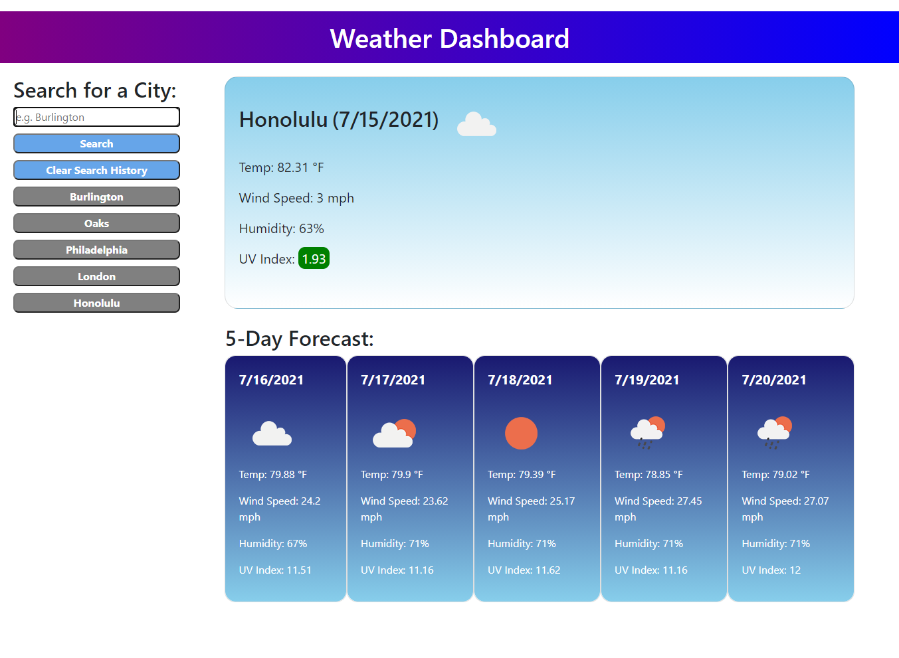

# weather-planner

This is a simple 5-day weather planner. Just type a city name and press "Search". You'll see the current weather conditions for your selected city, as well as the 5-day forecast. Everytime you search for a city, it will be displayed in your search history. If you would like to see the conditions for a city you have already searched, just click on it. Use the "Clear Search History" to delete all of the cities in your search history.

The URL is here: https://chillaroo.github.io/weather-planner/Develop/index.html

Here is a screenshot of the application: 